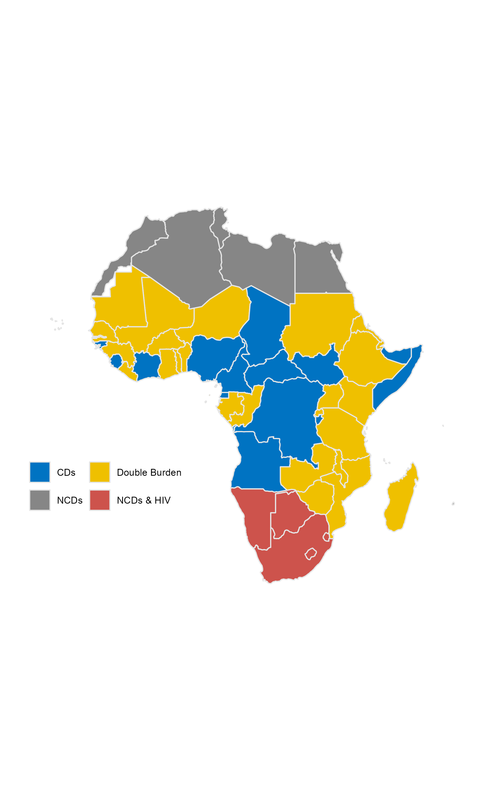

# The future of health in Africa: how achievable is SDG3?
This repository contain code for the analysis contained in the report *The future of health in Africa: how achievable is SDG3?* (2019, unpublished).  

| File | Description | Notebook
| ------------- | ------------- | ------------- |
| [data_for_ifs.Rmd](data_for_ifs.Rmd) | Code for wrangling UNAIDS data into IFs format. | ...  | 
| [Exploration.Rmd](Exploration.Rmd) | Code for exploratory data analysis of African health outcomes, including initial cluster analysis. | ... | 
| [incidence_analysis.Rmd](incidence_analysis.Rmd) | Code for exploratory data analysis of communicable disease incidence, including a toy model for HIV incidence. | ... | 
| [mapping.Rmd](mapping.Rmd) | Code for mapping SDG3 analysis. Need to assess data dependency to allow the code to run (incomplete).   | ... | 
| [Maternal_mortality.Rmd](Maternal_mortality.Rmd) | Code for exploring nested model approach to analyzing models of maternal mortality. | ... | 
| [SDG3_cluster.Rmd](SDG3_cluster.Rmd) | Code for cluster analysis of African health outcomes. Includes knn analysis of cluster graduation (using forecasts from IFs) and some exploratory PCA. | ... | 
| [SDG3_distance.Rmd](SDG3_distance.Rmd) | Code for developing a distance index for African countries toward SDG3 achievement. | ... | 
| [SDG_distance_percent.Rmd](SDG_distance_percent.Rmd) | Code for evaluating and visualizing distance as a percent (instead of as a standard deviation score). | ... | 

